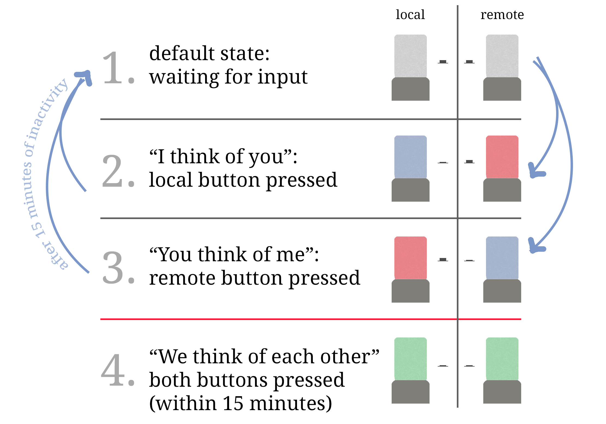
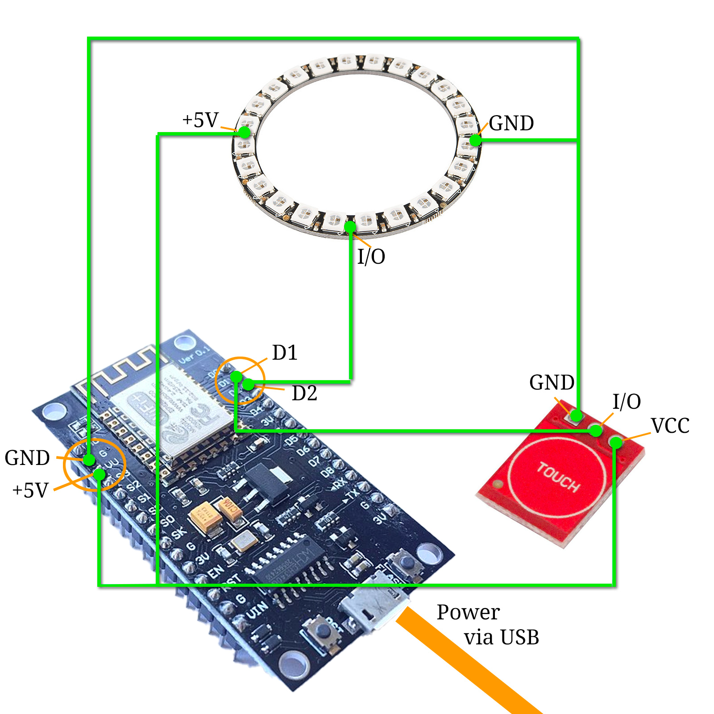

# DIY Remote Friendship Lamp
_Fight social distancing with a cool DIY electronics project!_ 

<a href="rfl_in_action_cut.jpg"></a>I've built a long-distance friendship lamp. I got the basic idea [from here](https://lastingthedistance.com/long-distance-friendship-lamps/) – but built and programmed it from ground up myself. It was a super easy DIY electronics project for beginners that you can easily copy, adapt or extend. Besides a bit of soldering and hardware tinkering, I used C++ in the Arduino IDE to program the microcontroller along with a bit of PHP for the webservice.

Spark joy by making your thoughts visible to a special someone in an interesting and colorful way ... or just have fun playing around with coding and electronics!  

<div style="clear:both;"></div>

## The basic idea

I wanted to have a pair of connected lamps – one for me to keep and one to send out to distant family members. Whenever one party presses a button on the lamp, it lights up in COLOR A, while the remote lamp lights up in COLOR B. After 15 minutes, both lamps automatically turn off again. If during that 15-minute period the other party also presses the button, both lamps will light up in COLOR C for 15 minutes.

**I guess, you could call it a sophisticated electronic "I think of you" mechanism with "I think of you as well" response functionality.**


## The Logic

### Lamps

Okay, so each lamp has 3*ish* states:

1. I think of you => COLOR A
2. You think of me => COLOR B
3. We both think of each other => COLOR C
4. (also there kinda is a fourth "setup" state, in which the lamp boots and waits for the WiFi connection to get established – it pulses in COLOR D while doing that)
5. (and, of course, there is a fifth "off, but waiting for instructions" state)

Once a minute, each lamp asks a webservice if it is supposed to turn on – and if so, which color it should display. At each call, the webservice checks in the background whether there have been any changes within the last 15 minutes: if yes, the current state is still valid and it returns the color that should be displayed. If not, it resets the statuses and tells both lamps to turn off.



### Webservice

From a lamp's perspective, all the webservice does, is returning a RGB code. Therefore I wrote a little PHP script that reads and writes a text file for each lamp. I tuses the file's "last modified" meta information to determine whether there have been changes in the last 15 minutes. If "last modifided" is > 15 minutes, that means there have not been any recent changes, it resets the files by writing "0,0,0" into them.

The logic behind that in detail:

- The service is called via HTTPS along with three GET parameters:

  1. key => just for authentiction purposes to not unnecessarily open the webservice up

  2. identifier => for telling the service which lamp the request is from

  3. mode => can have one of two values:

  - `get-status`=> the corresponding status text file is read and its contents are send back to the lamp as a comma-separated RGB value (i. e. `133,7,0`); also: with each status check, the status text files' `last_modified` date is read – after 15 minutes in which no `set-status` request was registered, all status files will be reset to `0,0,0`
  - `set-status` => we need to consider two cases:
    - lamp was off => then we set it to "I think of you" by writing COLOR A to the file for _this_ lamp and COLOR B ("You think of me") to the file for the _other_ lamp; also, the color code gets returned
    - lamp was already on and showed COLOR B => both lamps are being set to COLOR C ("We think of each other") by writing the corresponding color code to _both_ files (and returning als output)
    - (the third case "lamp was on and showed color A" doesn't really change anything in the states – but I decided to use this case to restart the 15-minute interval by saving the current colors to the text files again thus effectively resetting the last-modified information of each file)

#### A few thoughts that led me to exactly this solution (but I am very open to suggestions!):

- I already had webspace that I could use for this project and felt comfortable solving everything in PHP – but basiucally any technique that opens up a listening connection via the internet should work. You could maybe even use a VPN and let the lamps directly talk to each other!
- I wanted to be able to change colors, even after shipping the lamp – in my setup I just have to change the color variables in the PHP code. But, of course, you also could "hard wire" the colors right into the lamps if you prefer.
- Using the text files to save the status(es) enables me to use the files meta information to decide if time's up  – that proved to work quite reliably. 
- Yes, there is a little delay of < 60 seconds in which the colors could be not in sync (see video). But I guess that's okay. You can lower the `interval` in the C++ code to reduce this delay resulting in more calls to the webservice.

## Hardware

### Electronics

What I've used to build this:

- a NodeMCU V3 (basically a ESP8266 with WiFi): [affiliate Link to Amazon Germany](https://amzn.to/2JmrAIg) | [non-affiliate link](https://www.amazon.de/gp/product/B06Y1ZPNMS/ref=ppx_yo_dt_b_asin_title_o01_s00?ie=UTF8&psc=1)
- a NeoPixel multicolor led ring with 24 leds: [affiliate Link to Amazon Germany](https://amzn.to/3mhcDFY) | [non-affiliate link](https://www.amazon.de/gp/product/B07L81WMC9/ref=ppx_yo_dt_b_asin_title_o02_s02?ie=UTF8&psc=1)
- a capacitive touch button: [affiliate Link to Amazon Germany](https://amzn.to/33nu28t) | [non-affiliate link](https://www.amazon.de/gp/product/B0769DKZN5/ref=ppx_yo_dt_b_asin_title_o02_s01?ie=UTF8&psc=1)
- (USB) cables and soldering equipment (I had that already laying around)

<a href="rfl_ring.jpg"></a> <a href="rfl_shade.jpg"></a> <a href="rfl_base.jpg"></a>

The hardware part is extremely easy (otherwise I probably would have failed): You just need to connect the touch button to GND and VU (= 5 Volt) as well as Pin D1. The pixel ring also connects to GND and VU as well as Pin D2. That's it. For power supply you can simply feed 5 Volt via USB or the VIN and GND pins.



### Lampshade

My wife has built that. I only know that the base is made of some kind of concrete clay – and the lamp shade is built out of diffusing lamp shade material that she glued thin fabrics on. The top is a Pringles lid which by chance happened to have exactly the right diameter. We hid most of the electronics in the lamp foot and hot glued the capacitive touch button to the inside of the lid – it is sensible enough to work through the plastic and that way we could effectively hide the button and its wiring. 

## Software

The software part is quite easy as well. My initial impulse was to not publicly show my spaghetti*ish* code – but, then I thougt "What the heck ...?!". By showing my inability to write clean code, I open myself up to criticism and feedback which hopefully will improve my coding skills in the long run. So here we go! 

### Part 1 of the software: C++ (Arduino) code on NodeMCU

```c++
/*
   Remote Friendship Lamp // Client Code
   23.11.2020
   Jürgen Krauß
   @MirUnauffaellig
*/
#include <Arduino.h>
#include <Adafruit_NeoPixel.h>
#ifdef __AVR__
  #include <avr/power.h>
#endif
#include <ESP8266WiFi.h>
#include <ESP8266WiFiMulti.h>
#include <ESP8266HTTPClient.h>
#include <WiFiClientSecureBearSSL.h>
#include <math.h>

// Depending on the Board ID, the code decides which WiFi credentials to use
#define STASSID_dth "wifi_ssid_1"
#define STAPSK_dth  "wifi-psk-1"
#define STASSID_ka "wifi_ssid_2"
#define STAPSK_ka "wifi-psk-2"

#define LAMP_PIN   4
#define BUTTON_PIN 5
#define NUMPIXELS 24 // Number of leds on the Neopixel ring

#define K_ID   16047792 // These are my ESP board ids to distinct between the two lamps. 
#define S_ID   6553442
  
String target_url = "https://WEBSERVICE_URL/lamp/api.php?key=AUTH_KEY&identifier=";
String lamp_id ="";

int interval = 60000; // This is the 1-minute interval in which the lamps connect to the webservice
int since_start = 0;
int current_loop_time = 0;
int LEDr = 0;
int LEDg = 0;
int LEDb = 0;

Adafruit_NeoPixel pixels(NUMPIXELS, LAMP_PIN, NEO_GRB + NEO_KHZ800);
ESP8266WiFiMulti WiFiMulti;

void setup() {
  Serial.begin(115200); 
  Serial.print("\n");
  Serial.print("\n");
  Serial.print(" ESP8266 Chip id = ");
  Serial.print(String(ESP.getChipId()));
  Serial.print("\n");

  #if defined(__AVR_ATtiny85__) && (F_CPU == 16000000)  // Not really sure if this is needed ...
    clock_prescale_set(clock_div_1);
  #endif
  
  pixels.begin();
  pixels.clear();
  pinMode(BUTTON_PIN, INPUT);
  
  Serial.println();
  WiFi.disconnect(); // Otherwise it caches and remembers old login data
  delay(500);
  
  WiFi.mode(WIFI_STA);
  
  Serial.println("Using: ");
  Serial.print("  - ");
   
  if (ESP.getChipId() == K_ID) {  // By using the ESP.getId() function, we get an unique identifier for each lamp – 
                              // so the same code can be used on both lamps and let the software decide which WiFi credentials to use.
    WiFiMulti.addAP(STASSID_dth, STAPSK_dth);
    lamp_id = "lamp-1";
    Serial.print(STASSID_dth);
    Serial.print(" | ");
    Serial.print(STAPSK_dth);
  }
  if (ESP.getChipId() == S_ID) { 
    WiFiMulti.addAP(STASSID_ka, STAPSK_ka);
    lamp_id = "lamp-2";
    Serial.print(STASSID_ka);
    Serial.print(" | ");
    Serial.print(STAPSK_ka);
  }
  
   Serial.print("\n");
   Serial.print("  - Lamp ID: ");
   Serial.print(lamp_id);
   Serial.print("\n  - ");
   target_url = target_url + lamp_id;
   Serial.print(target_url + "\n");
   delay(500);
   
   while (WiFiMulti.run() != WL_CONNECTED) {  // Waiting for the WiFi to connect
    doAnimation("setup");
    Serial.println("Waiting for WiFi to connect");
    if (millis() > 60000 * 5) { // After 5 minutes, try the other WiFi credentials ... because probably it wasn't shipped yet
      Serial.println("Could not connect to WiFi for 5 minutes, trying the other WiFi network");
      if (ESP.getChipId() == S_ID) { 
        WiFiMulti.addAP(STASSID_dth, STAPSK_dth);
        Serial.print(STASSID_dth);
        Serial.print(" | ");
        Serial.print(STAPSK_dth);
      }
      if (ESP.getChipId() == K_ID) { 
        WiFiMulti.addAP(STASSID_ka, STAPSK_ka);
        Serial.print(STASSID_ka);
        Serial.print(" | ");
        Serial.print(STAPSK_ka);
      }
      Serial.print("\n");
    }
   }
   doAnimation("ack");
   delay(500);
}

void loop() {
   if (digitalRead(BUTTON_PIN) == 1) { // If the button is pressed, user feedback is given and a change of the lamps' states are requested via the webservice
    Serial.println("Button pressed!");
    doAnimation("ack");
    myHttpRequest("&mode=set-status");
   }
   
  if (current_loop_time == 0 || current_loop_time > interval) { // Do this only AFTER EACH INTERVAL (= 60s)
    Serial.printf("Program runs since: ");
    Serial.print(millis());
    Serial.print("\n");
    Serial.printf("Current loop time: ");
    Serial.print(current_loop_time);
    Serial.printf("\n");
    since_start = millis();
    current_loop_time = 0;

    myHttpRequest("&mode=get-status"); // This is the once-every-60-seconds status check
  }
  
  current_loop_time = millis() - since_start;
  delay(10); // I guess this is not really needed but it doesn't make much sense to continously loop through everything millisecond after millisecond
}

/* ---- ---- ---- ---- ---- ---- ---- ---- 
 FUNCTIONS
---- ---- ---- ---- ---- ---- ---- ---- ---- */

// Function for a smooth color change (led after led)
void changeColor(uint32_t targetColor, int animationSpeed) {
  int delayStep = round(animationSpeed / NUMPIXELS);
  for (int i = 0; i < NUMPIXELS; i++) {
       pixels.setPixelColor(i, targetColor);
       pixels.show();
       if (delayStep > 0) {
        delay(delayStep);
       }
  }
}

// Function to split a string into an array
String getValue(String data, char separator, int index)
{
  int found = 0;
  int strIndex[] = {0, -1};
  int maxIndex = data.length()-1;

  for(int i=0; i<=maxIndex && found<=index; i++){
    if(data.charAt(i)==separator || i==maxIndex){
        found++;
        strIndex[0] = strIndex[1]+1;
        strIndex[1] = (i == maxIndex) ? i+1 : i;
    }
  }
  return found>index ? data.substring(strIndex[0], strIndex[1]) : "0";
}

// Functions for different kinds of animations
void doAnimation(String which) {
  if (which == "setup") {
    Serial.print("Setting up ... 5");
    changeColor(pixels.Color(100,50,0), 1000);
    Serial.print("... 4");
    changeColor(pixels.Color(80,30,0), 1000);
    Serial.print("... 3");
    changeColor(pixels.Color(100,50,0), 1000);
    Serial.print("... 2");
    changeColor(pixels.Color(80,30,0), 1000);
    Serial.print("... 1\n");
    changeColor(pixels.Color(100,50,0), 1000);
  }

  if (which == "error") {
    for (int i = 0; i < 5; i++) {
      Serial.println("ERROR");
      changeColor(pixels.Color(255,0,0), 0);
      delay(500);
      changeColor(pixels.Color(LEDr,LEDg,LEDb), 0);
      delay(500);
    }
  }

  if (which == "warning") {
    for (int i = 0; i < 3; i++) {
      Serial.println("WARNING");
      changeColor(pixels.Color(100,50,0), 1000);
      delay(500);
      changeColor(pixels.Color(LEDr,LEDg,LEDb), 0);
      delay(500);
    }
  }

  if (which == "ack" || which == "ack_off") {
    changeColor(pixels.Color(255,255,255), 0);
    delay(500);
    if (which == "ack_off") {
       LEDr = 0;
       LEDg = 0;
       LEDb = 0;
     }
    changeColor(pixels.Color(LEDr,LEDg,LEDb), 0);
  }
}

// This gets called to connect to the webservice, either for getting or for setting the lamp color
// Here a simple HTTPS web request is being use – but this could be easily changed to support i. e. web sockets or something completely different 
void myHttpRequest(String statusMode) {
   if ((WiFiMulti.run() == WL_CONNECTED)) {
      std::unique_ptr<BearSSL::WiFiClientSecure>client(new BearSSL::WiFiClientSecure);
      client->setInsecure();
      HTTPClient https;
      Serial.print("[HTTPS] begin...\n");
      if (https.begin(*client, target_url + statusMode)) {  
        Serial.print("[HTTPS] GET...");
        Serial.print(target_url + "&mode=get-status");
        Serial.print("\n");
        
        // start connection and send HTTP header
        int httpCode = https.GET();
    
        // httpCode will be negative on error
        if (httpCode > 0) {
          // HTTP header has been send and Server response header has been handled
          Serial.printf("[HTTPS] GET... code: %d\n", httpCode);
    
          // file found at server
          if (httpCode == HTTP_CODE_OK || httpCode == HTTP_CODE_MOVED_PERMANENTLY) {
            String payload = https.getString();
            Serial.println(payload);
            if (payload != "") {
                LEDr = getValue(payload, ',', 0).toInt(); 
                LEDg = getValue(payload, ',', 1).toInt();
                LEDb = getValue(payload, ',', 2).toInt();
                Serial.print("R: ");
                Serial.print(LEDr);
                Serial.print(" G: ");
                Serial.print(LEDg);
                Serial.print(" B: ");
                Serial.print(LEDb);
                Serial.print("\n");
                changeColor(pixels.Color(LEDr, LEDg, LEDb), 1000);
              } else {
                doAnimation("off");
              }
            }
          
        } else {
          Serial.printf("[GET] Request... failed, error: %s\n", https.errorToString(httpCode).c_str());
          doAnimation("error");
        }
    
        https.end();
      } else {
        Serial.printf("[HTTPS.begin] Unable to connect\n");
        doAnimation("error");
      }  
   } else {
    Serial.printf("[WiFiMulti.run] failed to connect\n");
    doAnimation("error");
  }  
}
```

**Important note:** You need to get the NodeMCU into your Arduino IDE via the board manager. Also, you'll need the Neopixel libary for using the led ring. (In case you decide to use the same materials as me.)

### Part 1 of the software: PHP code on webserver

```php
<?php 
/*
   Remote Friendship Lamp // Server Code
   23.11.2020
   Jürgen Krauß
   @MirUnauffaellig
*/

/* Possible GET parameters and values (that's maybe an unnecessary layer of security but gives you a good feeling for which values to expect in your script) */
$valid = array(
	"mode" => array(true, array("get-status", "set-status", "admin")),
	"identifier" => array(true, array("lamp-1", "lamp-2")),
	"key" => array(true, array("AUTH_KEY")),
	"status" => array(false)
);
$colors = array("i_think" => "9,33,211", 
		"you_think" => "229,11,11", 
		"we_think" => "0,204,0");

/* Check existence and plausibility of GET parameters AND copy them into local variables for easier referencing */
foreach ($valid as $key => $v):
	if ($v[0]):
		if (!(isset($_GET[$key])) || (!in_array($_GET[$key], $v[1]))):
			die("Wrong or no parameters."); 
		endif;
		$$key = $_GET[$key];
	else:
		if (isset($_GET[$key])) $$key = $_GET[$key];
	endif; 
endforeach;

/* Read status file(s) (or create it) */
$statusfile = $identifier.".txt";
if ($identifier == $valid['identifier'][1][0]) $otherfile = $valid['identifier'][1][1].".txt"; else $otherfile = $valid['identifier'][1][0].".txt"; 

if (!file_exists($statusfile)) file_put_contents($statusfile, "");
if (!file_exists($otherfile)) file_put_contents($otherfile, "");

$last_modified = date ("d.m.Y H:i:s", filemtime($statusfile));

/* Mode switcher */
switch($mode) { 
	/* getting the status */
	case "get-status":
		$diff = round((time()-filemtime($statusfile))/60);
		$diff_other = round((time()-filemtime($otherfile))/60);

		// If file older than 15 minutes, reset it
		if ($diff > 15 && $diff_other > 15) {
			file_put_contents($statusfile, "0,0,0");
			file_put_contents($otherfile, "0,0,0");
		}

		$fc = file_get_contents($statusfile);
		$fc = explode(",", $fc);
		if (count($fc) != 3) { 
			echo "0,0,0";
		} else { 
			$i = 0;
			foreach ($fc as $f) {
				if (!is_integer($f*1)) {
					echo "0";
				} elseif ($f >= 255) {
					echo "255";
				} elseif ($f < 0) {
					echo "0";
				} else {
					echo $f;
				}
				if (++$i <= 2) echo ",";
			}
		}
	break;

	/* setting the status */
 	case "set-status":
		if (file_get_contents($statusfile) == "0,0,0" || file_get_contents($statusfile) == $colors['i_think']) { 
 			file_put_contents($statusfile, $colors['i_think']);
 			echo $colors['i_think'];
 			file_put_contents($otherfile, $colors['you_think']);
 		} elseif (file_get_contents($statusfile) == $colors['you_think'] || file_get_contents($statusfile) == $colors['we_think']) {
 			file_put_contents($statusfile, $colors['we_think']);
 			echo $colors['we_think'];
 			file_put_contents($otherfile, $colors['we_think']);
 		}
	break;

	/* debugging info */
	case "admin": 
		echo "<pre style=\"font-size: 1.5em;\">";
		
		$txtfiles = (listfiles("./", "txt"));
		if (count($txtfiles) > 0) {
			foreach ($txtfiles as $t) {
				echo "<p>";
				$diff = round((time()-filemtime($t))/60). " minutes";
				echo "<strong>".$t."</strong> | file age: ".date ("d.m.Y H:i:s", filemtime($t))." | ".$diff."\n";
				echo file_get_contents("./".$t)."";
				echo "</p>";
			}
		}
		echo "<br />";
		echo "<p>";
		var_dump($valid);
		echo "</p>";
		echo "</pre>";
	break;
}	

function listfiles($dir, $filter_ext) {
	$return = array();
	if ($handle = opendir($dir)) {
	    while (false !== ($entry = readdir($handle))) {
	    	if ($entry != "." && $entry != ".." && ".".$filter_ext == substr($entry, -1*(strlen($filter_ext)+1)) ) {
	            $return[] = $entry;
	        }
	    }
	    closedir($handle);
	}
	return $return;
}
?>
```

Have fun rebuilding or improving this – and don't forget to [let me know about it](https://twitter.com/MirUnauffaellig)!

## Licensing info

This project with all its contents is under CC BY NC 4.0 license. Learn more about what you may and what you may not do here: ([German](https://creativecommons.org/licenses/by-nc/4.0/deed.de) | [English](https://creativecommons.org/licenses/by-nc/4.0/deed.en))

## Post Scriptum
After writing this, I found [another remote friendship lamp project](https://www.instructables.com/Filia-the-Homemade-Friendship-Lamp/) that even has an access-point mechanic for entering wifi credentials. Sweet! I might implement that in a future version (if I'll ever built another one).
